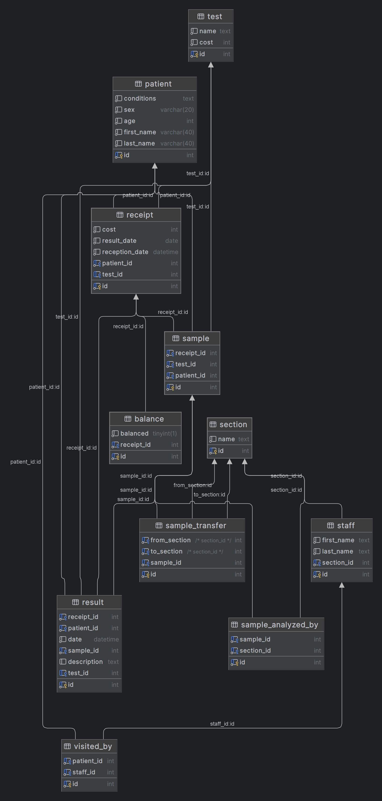

# Design Document

By Parsa Estakhri

Video overview: <URL https://youtu.be/u46iVUrX8pA>

## Scope

this database provides simple data management for a medical-pathology lab and keeps track of patients and samples inside a labratory.
it includes :

* patients' information such as age,first name and last name, social id etc..
* lab analysts and their first name and last name, the section they're working in.
* patient samples and the section are analyzed in also transfered to.
* costs of each patient's receipt
* result for each patient's requested test

out of scope elements such as insurance company realtions and doctor recommendations.

## Functional Requirements

* user can perform CRUD on each one of the tables.
* a user can transfer samples from each section to another one.
* user can determine which sample is analyzed by which one of the sections.
* user can construct a result for a reciept.

connection to insurance and hospital systems are out of the scope of this project.
constructing user feed back is not included in system.
doctor's recommendation and viewing the request doctor's info is out of the capablities of this project.

## Representation

This database has been constructed with the following schema :

### Entities

this database includes the following entities

#### test
the `test` table includes :
* `id` as the an `INT` id of the test to recognize.
* `cost` as `int` to determine each test's cost.
* `name`as `text` which provides name of each test

#### patient
the `patient` table has the following columns :
* `conditions` as `text` that describes the condition and symptoms that a patient comes to the lab with.
* `sex` as `varchar` that provides a column for patient's gender.
* `age` as `int` tells us about the age of the each patient.
* `first_name` and `last_name` as `varchar` that provides us with name of the patient.
* `id` as the social number of the patient.

#### receipt
the `receipt` table has been created because each `patient` might visit the lab more than 1 time. the table includes :
* `cost` as `int` which is the amount a patient must pay.
* `result_date` as `date` which is the day that patient's test result is ready.
* `reception_date` as `datetime` which is the time that patient has received a receipt.
* `patient_id` is a `foreign key` to the `patient` table, it tells us which `receipt` is related to which `patient`.
* `test_id` is also a `foreign key` to the `test` table, it determines which `test` has been registered on this `receipt`.
* `id` as in `int`, which is the id of the receipt and also the `primary key`.

#### sample
the `sample` table includes the following columns :
* `receipt_id` as `foregin key` that which sample is related to which `receipt`.
* `test_id` as `foreign key` which tells us what `test` is this `sample` is going to be needed.
* `patient_id` as `foreign key` determines that which sample is from which patient.
* `id` of the sample as a `primary key`

#### balance
the `balance` table contains the following columns :
* `balanced` as `tinyint(1)`, if the patient has paid the fees, this field will be `1`, else it will be `0`.
* `receipt_id` as `foreign key`, to determine which receipt has paid the fees.
* `id` as `int` as `primary key`.

#### section
each lab has multiple `section`s, the `section` table contains the following columns :
* `name` as `text`, is the name of the each section.
* `id` as `int` as `primary key` of the `section`.

#### sample_analayzed_by
this table tells us about which `sample` is being analayzed by which `section`
* `sample_id` as `foreign key` which is the id of the `sample` being analyzed.
* `section_id` as `foreign key` which is the id of the `section` that runs the analysis on the test.
* `id` as `int` as `primary key`.

#### sample_transfer
this table keeps track of the transfer of each `sample` from one `section` to another.
* `from_section_id` as `foreign key` determines the start `section` of transfer.
* `to_section_id` as `foreign key` determines the end `section` of the transfer.
* `sample_id` as `foreign key` which is the `id` of the `sample` being transfered.
* `id` as `int` as `primary key` of the transfer.

#### result
the `result` table includes :
* `receipt_id` as `foreign key` which is the `receipt` that `result` is construced for.
* `patient_id` as `foreign key` which determines which `patient` is the result for.
* `date` as `datetime` which is the time result is constructed.
* `test_id` as `foreign key` which is the `test` is the result constructed on.
* `id` as `int` as `primary key` of the `result` table.

#### staff
this table includes :
* `first_name` of the staff as `text`.
* `last_name` of the staff as `text`.
* `section_id` as `foreign key` which is the `section` is the staff working.
* `id` as `int` which is the `primary key` of the table

#### visited_by
this table tells us about each `patient` is visited by each one of the `staff`. it includes :
* `patient_id` as `foreign key` which is the `id` of the recepted `patient`.
* `staff_id` as `foreign key` which is `id` of the `staff` whom visited the `patient`.

### Relationships
the following section is the ER diagram of this database.

* each patient can have multiple receipts
* each receipt can have one test and one patient.
* each sample can have only one test,patient and receipt.
* each balance has only one receipt.
* each staff can only have one section.
* each result can only be for one patient and receipt.

## Optimizations

* optimizations has been made on the `id` field of the `patient`, `result` and `sample` as those tables have been used alot in queries.

## Limitations

* this database each assumes each receipt contains only for one test. also it is not capable of verifying the data from insurance.  
